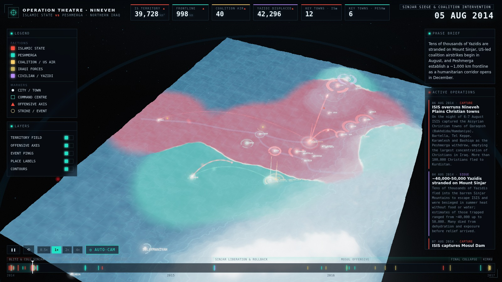

# ISIS vs the Peshmerga — Interactive 3D War Map (2014–2017)

A cinematic, time-progressing **operational war map** of the war between the
**Islamic State (ISIS/ISIL)** and the **Kurdish Peshmerga** across northern Iraq,
June 2014 – October 2017. Built as a real-time 3D scene with a minimalist
modern-military / command-table aesthetic.

The clock sweeps from the fall of Mosul through the siege of Sinjar, the
coalition intervention, the Peshmerga counter-offensives, the liberation of
Sinjar and Mosul, and the October 2017 Kirkuk reversal — while the map's
**territory field, frontline, offensive arrows, glowing bases and live HUD
counters** all update in step.



🎬 **Rendered fly-through:** [`media/isis-peshmerga-war-map.webm`](media/isis-peshmerga-war-map.webm)

---

## What it shows

- **3D elevation terrain** of the theatre — the Sinjar Mountains, the Zagros /
  Qandil highlands, the Mateen-Gara ranges and the Tigris/Great-Zab valleys —
  procedurally generated from real geographic anchors, with topographic
  contour lines and an operations graticule.
- **Morphing territory & frontline.** A faction *influence field* (ISIS red vs.
  Peshmerga/anti-ISIS cyan) is interpolated from dated control snapshots and
  rendered straight into the terrain shader, with a glowing contested seam that
  shifts as towns change hands.
- **Glowing site markers** — cities, forward bases and **command centres**
  (Peshmerga GHQ, ISIS Mosul HQ, the coalition joint-ops hub) with pulse rings,
  HQ beams and brackets. Hover any marker for details.
- **Animated offensive axes.** Each operation draws itself as a lifted, flowing
  "attack vector" arc with a moving arrowhead exactly as the timeline reaches it.
- **Event pings** — expanding shockwaves and flashes (airstrikes get a descending
  streak) that flare as the clock passes each event.
- **Live HUD** — ticking counters (ISIS territory km², frontline length,
  cumulative coalition airstrikes, Yazidi displaced, key towns held by each
  side), a phase brief, a streaming *active operations* feed, and a scrubbable
  timeline with phase bands and per-event ticks.

## Controls

| Action | Control |
| --- | --- |
| Orbit / tilt | drag the scene |
| Zoom | scroll / pinch |
| Seek | click or drag the timeline |
| Play / pause | `❚❚` button |
| Restart | `⟲` button |
| Speed | `0.5× / 1× / 2× / 4×` |
| Auto camera | `◎ AUTO-CAM` (cinematic orbit that drifts toward the action) |
| Toggle layers | LAYERS panel (territory, axes, pings, labels, contours) |
| Inspect a site | hover a marker |

## Run it

```bash
npm install
npm run dev        # http://localhost:5173  (Vite dev server)
```

Or serve the committed, fully self-contained production build (Three.js is
bundled locally — **no CDN or network required**):

```bash
npm run build      # -> dist/
npm run preview    # http://localhost:4173
```

### Render the video

```bash
npm run preview &           # serve the build
node scripts/record.mjs     # deterministic frame-exact capture -> media/*.webm
```

`scripts/record.mjs` drives the app in a deterministic record mode (fixed
timestep per frame), screenshots every frame and encodes a WebM — so the output
is perfectly smooth regardless of headless render speed. `scripts/verify.mjs`
captures still frames at several timeline positions for quick visual checks.

## Data & methodology

The conflict dataset (`src/data/conflict.json`) was compiled and
**adversarially fact-checked by a multi-agent research workflow**
(`research/build-dataset.workflow.mjs`):

1. Parallel period researchers covered each phase of the war (the June 2014
   blitz, the August crisis, the 2014–15 counter-offensives, and Mosul →
   Kirkuk 2016–17), plus a geography pass for coordinates, elevations and order
   of battle.
2. An **adversarial verification** stage independently re-checked the most
   load-bearing dates and headline numbers against reputable sources
   (Wikipedia campaign articles, HRW, ISW, BBC, Reuters, Rudaw, CJTF-OIR).
3. A curation stage produced the monthly stat time-series, and a completeness
   critic flagged gaps.

10 of 13 critical claims were confirmed outright and 3 were refined with
sources (e.g. the Yazidi flight to Mount Sinjar dated to **3 Aug 2014**, and
ISIS's Iraq-only peak area put nearer **~55,000 km²**). The raw verified output
is in `research/research-output.json`; the source list and verification notes
are in [`research/SOURCES.md`](research/SOURCES.md).

> **Note.** This is a *stylised operational reconstruction* of real, tragic
> events for educational visualisation. Territory is an interpolated influence
> field, not a surveyed boundary; counters are approximate, source-cited
> figures. Coordinates are real; the terrain relief is procedurally synthesised
> from real geographic anchors rather than a survey DEM.

## Tech

- **Three.js** (WebGL2) — custom terrain/territory/arrow shaders, `UnrealBloom`
  post-processing, `OrbitControls`.
- **Vite** build; **Playwright** + the bundled **ffmpeg** for headless capture
  and video encoding.
- No runtime network dependencies — everything is bundled into `dist/`.

## Project structure

```
index.html              # HUD scaffold + canvas
src/
  main.js               # orchestrator: scene, post-fx, clock, interactivity, record mode
  style.css             # command-table HUD theme
  lib/
    geo.js              # lat/lon projector, palette, date & noise helpers
    terrain.js          # heightmap + terrain shader (relief, contours, territory, seam)
    territory.js        # time-interpolated faction influence field -> texture
    markers.js          # cities / bases / command centres
    arrows.js           # offensive "attack vector" arcs
    events.js           # event pings (shockwaves, flashes, strikes)
    camera.js           # cinematic auto-cam + OrbitControls
    hud.js              # counters, legend, layers, timeline, feed
  data/conflict.json    # the verified dataset
research/               # research workflow, raw verified output, sources
scripts/                # record.mjs, verify.mjs, build-data.mjs
```

---

## Also in this repository

### `quant/` — systematic equity strategies with asymmetric risk construction

An unrelated, self-contained Python research stack: a momentum signal library, a
sequential backtest engine with cost and capacity modelling, an explicitly
asymmetric portfolio construction layer, and the evaluation machinery — purged
walk-forward validation, deflated Sharpe, PBO — needed to tell a real effect from
a well-fitted one.

```bash
cd quant && pip install -r requirements.txt
make research          # data -> signals -> backtest -> ablation -> sweep -> walk-forward
```

See [`quant/README.md`](quant/README.md), which includes a worked example of the
stack catching an overfitted conclusion drawn during its own development.
